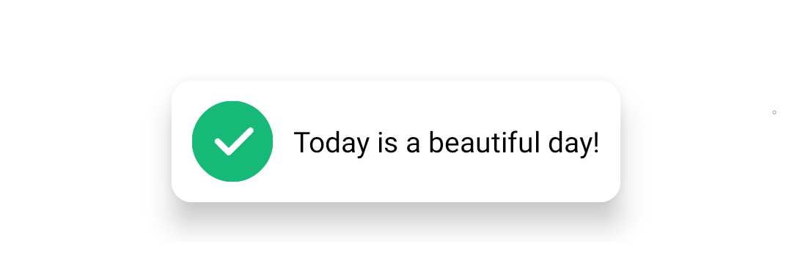
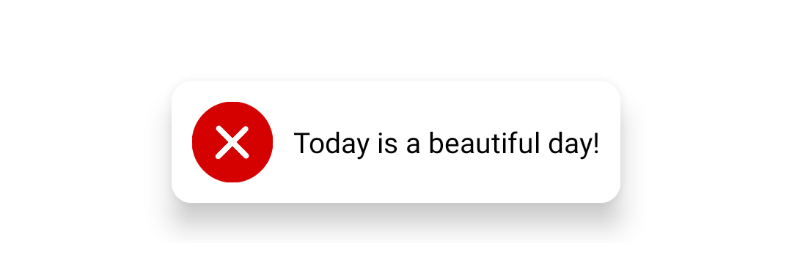
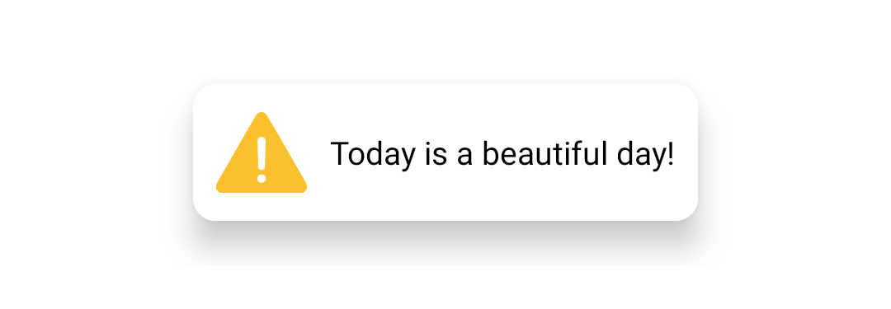
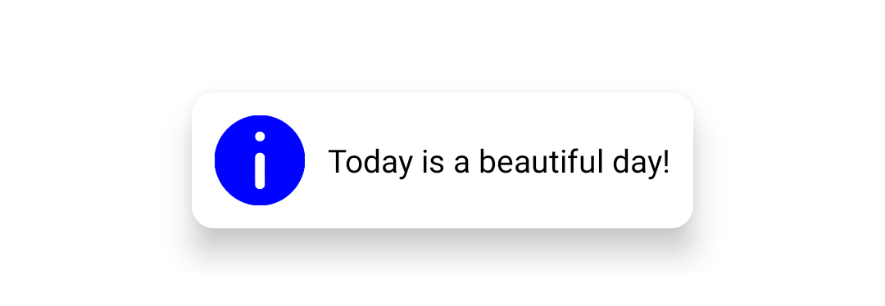
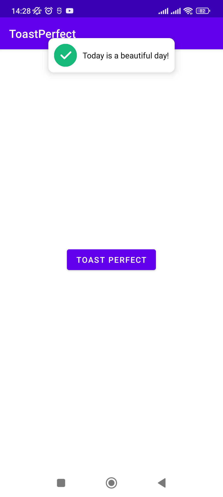
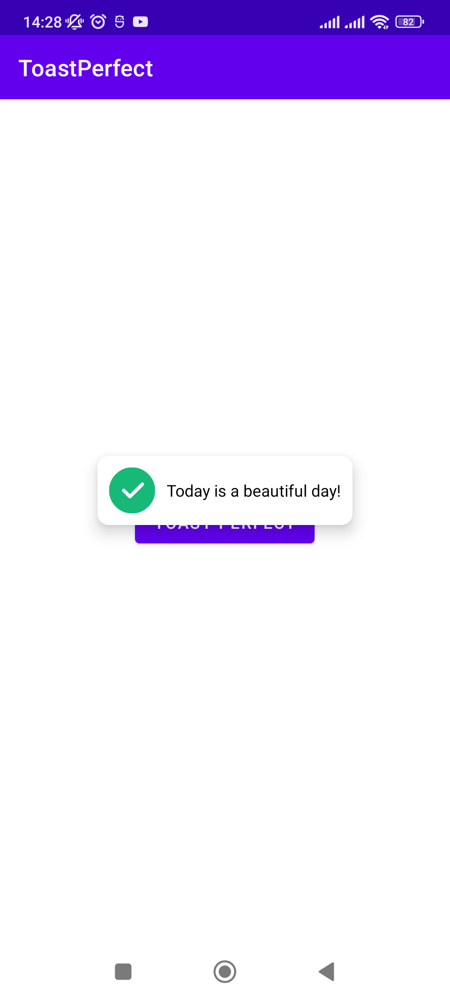
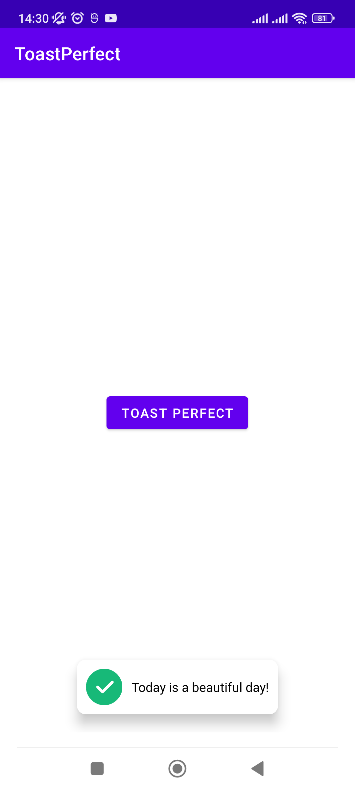

# ToastPerfect Android Library

[](https://jitpack.io/#thang-uit/ToastPerfect)
[](https://jitpack.io/#thang-uit/ToastPerfect)
[](https://search.maven.org/search?q=g:%22io.github.thang-uit%22%20AND%20a:%22toastperfectlibrary%22)

## Description
    ToastPerfect help you display Toast library for Android more beautiful and professional.
    The library provides 4 common simple toast messages (Success, Error, Warning and Information).
    I'm create this library with the purpose of improving user interface and helping me save development time.

Download
-----

Gradle is the only supported build configuration, so just add the dependency to your project `build.gradle` file:

```groovy
dependencies {
    implementation 'io.github.thang-uit:toastperfectlibrary:1.0.1'
}
```

Usage
-----

**MainActivity.java**

```java
// Easy to display Toast
ToastPerfect.makeText(this, ToastPerfect.SUCCESS, "Today is a beautiful day!", ToastPerfect.BOTTOM, ToastPerfect.LENGTH_SHORT).show();
```

**Toast Messages Available into the Library**

The library provides 4 common simple toast messages (Success, Error, Warning and Information). The table below shows a complete example with its pictures.
| Toast | Picture |
| ------------- | ------------- |
| `ToastPerfect.makeText(this, ToastPerfect.SUCCESS, "Today is a beautiful day!", ToastPerfect.BOTTOM, ToastPerfect.LENGTH_SHORT).show();` | </img>  |
`ToastPerfect.makeText(this, ToastPerfect.ERROR, "Today is a beautiful day!", ToastPerfect.BOTTOM, ToastPerfect.LENGTH_SHORT).show();` | </img>  |
`ToastPerfect.makeText(this, ToastPerfect.WARNING, "Today is a beautiful day!", ToastPerfect.BOTTOM, ToastPerfect.LENGTH_SHORT).show();` | </img>  |
`ToastPerfect.makeText(this, ToastPerfect.INFORMATION, "Today is a beautiful day!", ToastPerfect.BOTTOM, ToastPerfect.LENGTH_SHORT).show();` | </img>  |

**3 Position Display**

| ToastPerfect.TOP | ToastPerfect.CENTER | ToastPerfect.BOTTOM |
|---|---|---|
| </img> | </img> | </img> |


License
--------

    Copyright 2022 ThangUIT

    Licensed under the Apache License, Version 2.0 (the "License");
    you may not use this file except in compliance with the License.
    You may obtain a copy of the License at

        http://www.apache.org/licenses/LICENSE-2.0

    Unless required by applicable law or agreed to in writing, software
    distributed under the License is distributed on an "AS IS" BASIS,
    WITHOUT WARRANTIES OR CONDITIONS OF ANY KIND, either express or implied.
    See the License for the specific language governing permissions and
    limitations under the License.